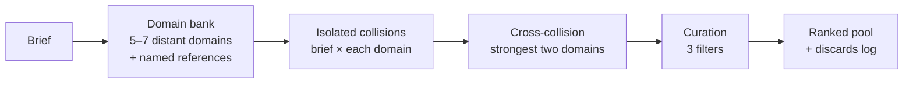

# open-collider

**English** · [Português](./skills/open-collider/SKILL.pt-BR.md)

**Stop getting the obvious answer. Escape the Artificial Hivemind.**

A Claude skill that generates genuinely non-obvious ideas by colliding structurally distant domains — then curating the noise down to a ranked pool. One markdown file. No dependencies, no server, no external state.

[Install](#install) · [How it works](#how-it-works) · [When to use](#when-to-use) · [Worked example](#worked-example) · [FAQ](#faq)

---

In a controlled study, collision prompting produced original ideas **4–13× more often** than asking a model to "be original" or feeding it more in-domain context — across **12 projects, ~23,000 generated ideas, and 4,320 pairwise human judgments** (CL-ML, *Escape the Artificial Hivemind*, 2026).

Built for anyone doing open-ended ideation in Claude — essayists, strategists, content people, founders — who keeps getting the answer everyone else already got.

## The problem

Ask an LLM for ideas and it converges on the dense center of its training distribution: the most probable answer, which is also the most common one. Adding more context about your topic barely moves it. Asking it to "think outside the box" barely moves it. The measured effect of both is small. This convergence is the **Artificial Hivemind** — the open-ended homogeneity of language models.

The counterintuitive fix: inject *less* related material, not more. A genuinely new idea emerges from the collision between two distant frames of reference — what Arthur Koestler called **bisociation** — when a hidden dimension of proximity between them is discovered.

## How it works



The skill builds a bank of 5–7 domains structurally far from your brief, each anchored to a **specific named reference** (not "aviation" — "Air France 447, 2009"). It collides your brief against each domain in an isolated block, runs one extra collision crossing the two strongest domains, then curates the ~100 raw ideas down through three filters — signal vs. noise, voice/style fit, your own "what makes an idea good" criterion — into a ranked pool.

| Without open-collider | With open-collider |
|-----------------------|--------------------|
| "Give me ideas" → the obvious ten, dressed up. More context, same center. | A domain bank pulls the model off-center; collisions force bridges it wouldn't reach; curation keeps only ideas that depend on the bridge. |

It also runs internal falsifiers before delivering: *if I dropped the domain bank and just used the brief, would I reach these same ideas?* If yes, it failed — and says so.

## When to use

**Use it when:**
- The brief is open-ended with no pre-defined thesis
- Previous output felt generic, obvious, or "sounded like any LLM"
- You explicitly want non-obvious angles, theses, or hooks
- You're generating ideas for an essay, campaign, product, or research direction

**Don't use it when:**
- The brief already has a strong thesis and needs convergence
- You're writing high-intent conversion copy (use a focused copy tool)
- You're fact-checking, editing, or doing QA
- You're under a hard token budget — this skill is expensive by design

## Worked example

Brief: *"Original angles for an essay on building a personal brand without sounding like everyone else."*

One domain in the bank: **lighthouse optics — the Fresnel lens (1822)**. Hidden dimension found: a brand and a lighthouse solve the same problem — being seen at a distance on little energy, by *concentrating* what's scattered instead of shouting louder. That bridge produces an angle no "be original" prompt reaches: *the editorial Fresnel lens — take twenty lukewarm opinions and bend them all into a single beam of thesis; the brightness comes from concentration, not volume.*

Full run — domain bank of six, an isolated collision, a cross-collision, the ranked pool, and the falsifier checks — in [examples/personal-brand-collision.md](./examples/personal-brand-collision.md).

## Install

```bash
# Via skills CLI (recommended)
npx skills add 1marcelserrano/open-collider

# Or manually — back up first if the folder already exists:
# mv ~/.claude/skills/open-collider ~/.claude/skills/open-collider.backup
git clone https://github.com/1marcelserrano/open-collider.git
cp -r open-collider/skills/open-collider ~/.claude/skills/
```

**Verify:** open a new Claude session and run `/skills` (or ask "what skills do you have?"). `open-collider` should be listed. If it isn't, check that `~/.claude/skills/open-collider/SKILL.md` exists and restart the session.

**No terminal?** Download [`open-collider.skill`](./open-collider.skill) and upload it in Claude (Cowork / claude.ai → Skills).

**Update:** `git pull` in the cloned repo, then re-copy. Changes are logged in [CHANGELOG.md](./CHANGELOG.md).

## How to run it

Open a Claude session with the skill installed and describe your ideation problem. The skill will:

1. **Ask the cost gate first.** It generates ~100 ideas before curating to ~10 — token cost is high. It tells you, and offers lighter alternatives when a full run isn't worth it.
2. **Brief you.** What's the open question? What makes an idea "good" here? Hard constraints? Where does the output go?
3. **Run the protocol** — domain bank → collisions → cross-collision → curation → ranked pool, with a log of interesting discards.

Fill [templates/brief-template.md](./templates/brief-template.md) ahead of time to skip the back-and-forth.

## When to say the trigger

Natural language works — just describe an open-ended ideation task and ask for non-obvious ideas. Explicit phrases that fire the skill:

- "open collider" / "bisociation" / "cross-domain prompting"
- "the previous output felt generic"
- "generate non-obvious ideas" / "beat the obvious"
- "distant domain collision" / "escape the hivemind"
- "generate angles / theses / hooks"

## The science

None of the underlying science is mine — and that's the point. This skill is a Claude skill **implementing the Open Collider protocol** described in:

- CL-ML (2026). *Escape the Artificial Hivemind.* Open Collider research — the protocol, the empirical validation, and the upstream project: [github.com/CL-ML/open-collider](https://github.com/CL-ML/open-collider)
- Jiang, L. et al. (2025). *Artificial Hivemind: The Open-Ended Homogeneity of Language Models.* [arXiv:2510.22954](https://arxiv.org/abs/2510.22954)
- Koestler, A. (1964). *The Act of Creation.* Hutchinson. — the theory of bisociation
- Hofstadter, D. & Sander, E. (2013). *Surfaces and Essences.* Basic Books. — analogy as the core of cognition
- Polanyi, M. (1958). *Personal Knowledge.* — the tacit dimension curation can't fully codify

This repo packages that protocol as an installable skill, with a worked example and a briefing template. The ideas above are the load-bearing ones; the link back to them is what makes this useful.

## FAQ

**Does it send my data anywhere?**
No. The skill is a markdown file Claude reads locally. Your brief and ideas stay inside your normal Claude session — nothing extra is stored or transmitted.

**Why is it "expensive by design"?**
Volume plus curation is the mechanism. Generating ~100 ideas across separate collisions is what beats the obvious; the cost is the price of distance. The skill always asks before a full run and suggests lighter passes when they'd do.

**How do I uninstall?**
`rm -rf ~/.claude/skills/open-collider`. Your files and data stay intact.

**What does it work with?**
Any chat-based Claude interface — Claude Code (CLI/desktop), claude.ai, Claude Cowork. macOS, Linux, Windows. It's just markdown.

**Will it be maintained?**
Yes. Versions follow [CHANGELOG.md](./CHANGELOG.md). Update with `git pull` or re-run `npx skills add`.

## About the author

Built by [Marcel Serrano](https://github.com/1marcelserrano), founder of [MSCREATIVE.SYSTEMS™](https://mscreative.systems) — Barcelona.

More on working with AI without losing your own voice: [Fronteirista](https://fronteirista.substack.com) — the free newsletter where these systems get built in public.

## Contributing

PRs welcome. See [CONTRIBUTING.md](./CONTRIBUTING.md).

## License

MIT — see [LICENSE](./LICENSE). Fork it, modify it, rebrand it — just keep the credits intact.

---

<sub>Forged at [MSCREATIVE.SYSTEMS™](https://mscreative.systems) — Barcelona</sub>
